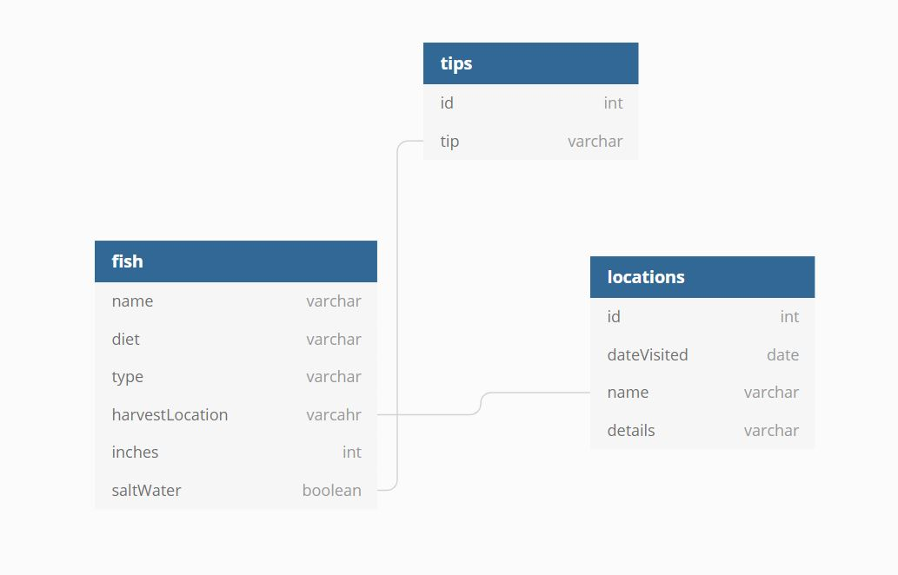

# Martin's-Aquarium

A class project that teaches how HTML, CSS and JS interact together. 
* Martin wants a simple website that can be grown and expanded as time and data are added. 

## Summary

The project introduces new students in NSS Web Dev boootcamp about HTML representation, flexboxing, and looping over things. 
Through this simple project, we also learned how to link pages together. 
* An API and ERD were created for pratice. 

## To View Repo
* Git clone this repo. Once cloned cd into the repo, then serve.

### ERD
